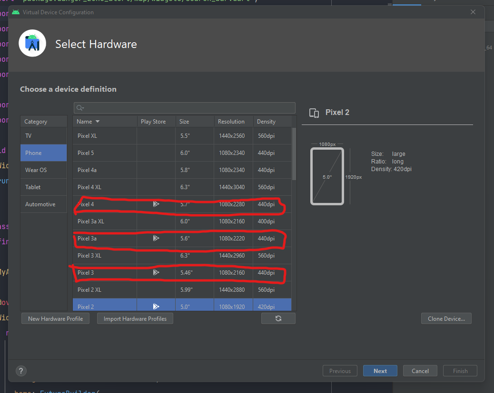
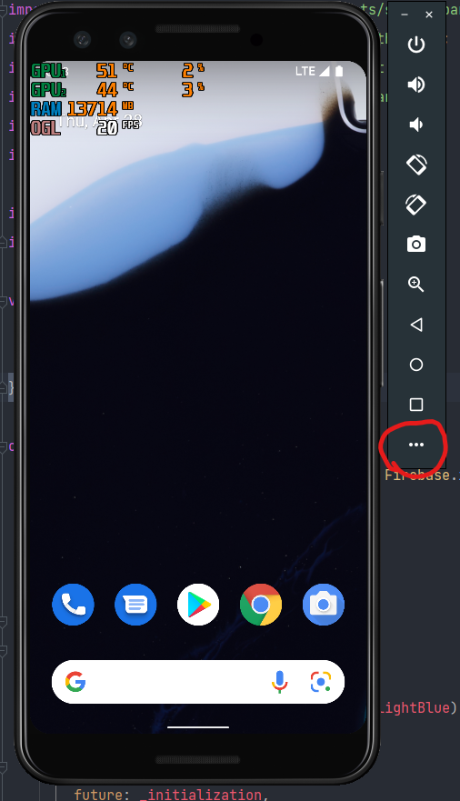
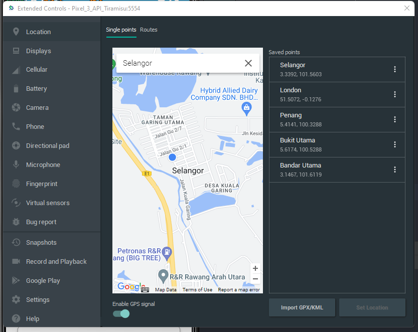
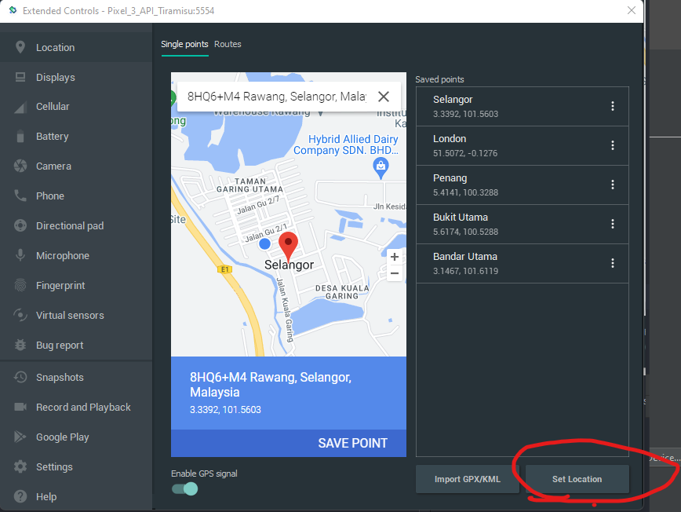
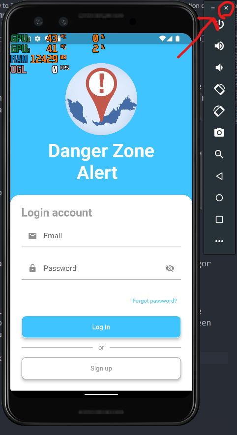

# Ways to Run the Danger Zone Alert Code

Due to the limitation size of moodle submission, please go to the GitHub link provide below to download the full code:
https://github.com/User100677/SWE-Project

Before running, you need to download the Flutter SDK and specific IDE.

For downloading Flutter SDK, both Windows and MacOS are similar:

1) Download Flutter SDK from this link:
	
	Windows: https://docs.flutter.dev/get-started/install/windows

	MacOS: https://docs.flutter.dev/get-started/install/macos

2) After downloading the SDK, add the Flutter onto your PATH environment variable.

3) Then, run "flutter doctor" in the command prompt to check what need to be fix.

Next, you will be downloading the IDE.

For Android system users,download and set up Android Studio from this link:

	https://developer.android.com/studio?gclid=Cj0KCQjw06OTBhC_ARIsAAU1yOXTp8KpZFGlSPgmr6jGKH4Nd6vag9dN_UjevpAp-bFrOrrQc-0Pqy8aAnplEALw_wcB&gclsrc=aw.ds

For iOS system users, download and set up Xcode from this link:

	https://developer.apple.com/xcode/

For more details on how to install Flutter SDK and IDE you can go this link:
	
	Windows: https://docs.flutter.dev/get-started/install/windows
	MacOS: https://docs.flutter.dev/get-started/install/macos

# How to run the code:

1) After installing the necessary equipment, you can go ahead and import the Danger Zone Alert files into your IDE.

2) Check that Project SDK in File -> project structure -> Project have selected the lates Android API Platform.

3) Check that Module SDk in File -> project structure -> Modules have selected Project SDK.

4) Go to the pubspec.yaml file in the project folder and navigate to the top and click on the "Pub get".

5) After that, open the main.dart file.

Now you are ready to run the code. There are two ways to make the app show up. The first way is to run the code in your emulator in the IDE. Another way is to run it in your phone directly.

## Emulator:
1) First you have to set up and open a emulator in your IDE. To set up the emulator, you can go this link below int the "Set Up Emulator/Simulation" section
	Windows: https://docs.flutter.dev/get-started/install/windows
	MacOS: https://docs.flutter.dev/get-started/install/macos

Notes: Make sure to create an emulator that supports the Play Store icon on the right as the map require its services.

2) Wait for your IDE to open the emulator completely and then click on the green play button.

3)Wait for a while and the app will show up in the emulator.

## Physical Device:
1) First you must enable developer option in your phone.

2) Then enable the USB debugging.

3) Plug your phone to your computer.

4) Wait for your IDE to detect your phone and then click on the green play button. The app will show up in your phone.

After succesfully run the app on the emulator, now it is time to change the location of the emulator as the initial GPS location of a fresh emulator's location isn't within Malaysia.

## Change the location of the emulator:

1. First click on the 3 horizontal align dot icon located at the bottom most of the emulator tab.

2. Then search any place in Malaysia in the text field. Example: Selangor

3. Select one of the autocomplete query and a marker will appear on the map. Click on the 'Set Location' button on the bottom right of the screen to set the location of the emulator.

4. Restart the emulator by first closing it by clicking the x icon present on top right of the emulator. Finally, try to start the emulator again and make sure the location of the emulator is in Malaysia. 
